# Organization Chart / 組織図

> **Tier 2 note**: CxO layer (16 roles) prompts are included in this pack.
> Department Head (部長) and below are placeholder roles — full prompts provided in Tier 3.

---

## English Version

### Hierarchy Overview

| Layer | Title | Count | Prompts Included |
|-------|-------|-------|-----------------|
| 0 | President (Human) | 1 | — (you) |
| 1 | C-Suite (CxO) | 16 | ✅ This pack |
| 2 | Department Head (Director) | 11 | ⬜ Tier 3 |
| 3 | Section Chief (Manager) | 17 | ⬜ Tier 3 |
| 4 | Individual Contributor | 25 | ⬜ Tier 3 |

**Total AI agents: 69**

### Org Chart (Mermaid)

```mermaid
graph TD
    PRES["👤 President<br/>(Human Decision Maker)"]

    subgraph CXO["Layer 1 — C-Suite (16 AI Agents)"]
        CEO["CEO<br/>Chief Executive Officer"]
        COO["COO<br/>Chief Operating Officer"]
        CTO["CTO<br/>Chief Technology Officer"]
        CFO["CFO<br/>Chief Financial Officer"]
        CMO["CMO<br/>Chief Marketing Officer"]
        CSO["CSO<br/>Chief Sales Officer"]
        CPO["CPO<br/>Chief Product Officer"]
        CCO["CCO<br/>Chief Content Officer"]
        CHRO["CHRO<br/>Chief HR Officer"]
        CLO["CLO<br/>Chief Legal Officer"]
        CIO["CIO<br/>Chief Information Officer"]
        CISO["CISO<br/>Chief Info Security Officer"]
        CDO["CDO<br/>Chief Data Officer"]
        CBO["CBO<br/>Chief Business Officer"]
        CAO["CAO<br/>Chief Admin Officer"]
        CRO["CRO<br/>Chief Risk Officer"]
    end

    subgraph DIR["Layer 2 — Department Heads (11 Agents) ⬜ Tier 3"]
        D01["Head of Strategy<br/>(under CEO)"]
        D02["Head of Engineering<br/>(under CTO)"]
        D03["Head of Infrastructure<br/>(under CTO)"]
        D04["Head of Finance & Accounting<br/>(under CFO)"]
        D05["Head of Marketing Ops<br/>(under CMO)"]
        D06["Head of Sales Ops<br/>(under CSO)"]
        D07["Head of Product Design<br/>(under CPO)"]
        D08["Head of Editorial<br/>(under CCO)"]
        D09["Head of People & Culture<br/>(under CHRO)"]
        D10["Head of Legal Affairs<br/>(under CLO)"]
        D11["Head of Data & Analytics<br/>(under CDO)"]
    end

    subgraph MGR["Layer 3 — Section Chiefs (17 Agents) ⬜ Tier 3"]
        M01["Strategy Lead"]
        M02["Backend Lead"]
        M03["Frontend Lead"]
        M04["DevOps Lead"]
        M05["Infra Lead"]
        M06["AR/AP Lead"]
        M07["Demand Gen Lead"]
        M08["SEO Lead"]
        M09["Sales Dev Lead"]
        M10["Account Mgmt Lead"]
        M11["UX Lead"]
        M12["Content Production Lead"]
        M13["Social Media Lead"]
        M14["Recruiting Lead"]
        M15["Compliance Lead"]
        M16["Data Engineering Lead"]
        M17["BI & Reporting Lead"]
    end

    subgraph IC["Layer 4 — Individual Contributors (25 Agents) ⬜ Tier 3"]
        I01["Strategy Analyst x2"]
        I02["Backend Eng x3"]
        I03["Frontend Eng x2"]
        I04["DevOps Eng x2"]
        I05["Infra Eng x2"]
        I06["Bookkeeper x1"]
        I07["Growth Analyst x2"]
        I08["SEO Specialist x1"]
        I09["SDR x2"]
        I10["Account Exec x2"]
        I11["UX Designer x1"]
        I12["Content Writer x2"]
        I13["Social Copywriter x1"]
        I14["Recruiter x1"]
        I15["Legal Researcher x1"]
        I16["Data Engineer x1"]
        I17["BI Analyst x1"]
    end

    PRES --> CEO
    PRES --> COO
    PRES --> CTO
    PRES --> CFO
    PRES --> CMO
    PRES --> CSO
    PRES --> CPO
    PRES --> CCO
    PRES --> CHRO
    PRES --> CLO
    PRES --> CIO
    PRES --> CISO
    PRES --> CDO
    PRES --> CBO
    PRES --> CAO
    PRES --> CRO

    CEO --> D01
    CTO --> D02
    CTO --> D03
    CFO --> D04
    CMO --> D05
    CSO --> D06
    CPO --> D07
    CCO --> D08
    CHRO --> D09
    CLO --> D10
    CDO --> D11

    D01 --> M01
    D02 --> M02
    D02 --> M03
    D03 --> M04
    D03 --> M05
    D04 --> M06
    D05 --> M07
    D05 --> M08
    D06 --> M09
    D06 --> M10
    D07 --> M11
    D08 --> M12
    D08 --> M13
    D09 --> M14
    D10 --> M15
    D11 --> M16
    D11 --> M17

    M01 --> I01
    M02 --> I02
    M03 --> I03
    M04 --> I04
    M05 --> I05
    M06 --> I06
    M07 --> I07
    M08 --> I08
    M09 --> I09
    M10 --> I10
    M11 --> I11
    M12 --> I12
    M13 --> I13
    M14 --> I14
    M15 --> I15
    M16 --> I16
    M17 --> I17
```



### Reporting Lines (Summary)

```
President (Human)
└── CEO (strategic direction, final AI authority)
└── COO (cross-CxO operations coordinator)
└── CTO ─── Head of Engineering ─── Backend/Frontend/DevOps Leads
│            Head of Infrastructure ── Infra/DevOps Leads
└── CFO ─── Head of Finance & Accounting ─── AR/AP Lead
└── CMO ─── Head of Marketing Ops ─── Demand Gen / SEO Leads
└── CSO ─── Head of Sales Ops ─── SDR / Account Mgmt Leads
└── CPO ─── Head of Product Design ─── UX Lead
└── CCO ─── Head of Editorial ─── Content Production / Social Leads
└── CHRO ── Head of People & Culture ─── Recruiting Lead
└── CLO ─── Head of Legal Affairs ─── Compliance Lead
└── CIO ─── (direct coordination, no Director layer in Tier 2)
└── CISO ── (direct coordination, no Director layer in Tier 2)
└── CDO ─── Head of Data & Analytics ─── Data Eng / BI Leads
└── CBO ─── (direct coordination, no Director layer in Tier 2)
└── CAO ─── (direct coordination, no Director layer in Tier 2)
└── CRO ─── (direct coordination, no Director layer in Tier 2)
```

---

## 日本語版

### 階層概要

| 階層 | 役職 | 人数 | プロンプト |
|------|------|------|-----------|
| 0 | 社長（人間） | 1 | — （あなた） |
| 1 | CxO（執行役員） | 16 | ✅ このパック |
| 2 | 部長 | 11 | ⬜ Tier 3 |
| 3 | 係長 | 17 | ⬜ Tier 3 |
| 4 | 一般スタッフ | 25 | ⬜ Tier 3 |

**AIエージェント 合計: 69名**

### 各CxOの担当領域

| CxO | 役割 | 直属部長 |
|-----|------|---------|
| CEO | 経営戦略・意思決定統括 | 企画戦略部長 |
| COO | 全社オペレーション調整 | ─ |
| CTO | 技術戦略・開発統括 | 開発部長、インフラ部長 |
| CFO | 財務・会計・資金管理 | 財務経理部長 |
| CMO | マーケティング・ブランド | マーケティング企画部長 |
| CSO | 営業・顧客獲得・リテンション | 営業推進部長 |
| CPO | プロダクト戦略・UX | プロダクト企画部長 |
| CCO | コンテンツ戦略・編集統括 | 編集制作部長 |
| CHRO | AIエージェント管理・組織設計 | 人事組織部長 |
| CLO | 法務・契約・コンプライアンス | 法務コンプライアンス部長 |
| CIO | 情報システム・ツール統合 | ─ |
| CISO | 情報セキュリティ・リスク | ─ |
| CDO | データ戦略・分析・AI/ML | データ分析部長 |
| CBO | 事業開発・パートナーシップ | ─ |
| CAO | 総務・施設・内部管理 | ─ |
| CRO | 全社リスク管理・危機対応 | ─ |

### 組織図（Mermaid）

```mermaid
graph TD
    PRES["👤 社長<br/>（人間）"]

    subgraph CXO["第1層 — CxO 執行役員（16名）"]
        CEO["CEO"]
        COO["COO"]
        CTO["CTO"]
        CFO["CFO"]
        CMO["CMO"]
        CSO["CSO"]
        CPO["CPO"]
        CCO["CCO"]
        CHRO["CHRO"]
        CLO["CLO"]
        CIO["CIO"]
        CISO["CISO"]
        CDO["CDO"]
        CBO["CBO"]
        CAO["CAO"]
        CRO["CRO"]
    end

    subgraph DIR["第2層 — 部長（11名）⬜ Tier 3 で提供"]
        D01["企画戦略部長"]
        D02["開発部長"]
        D03["インフラ部長"]
        D04["財務経理部長"]
        D05["マーケティング企画部長"]
        D06["営業推進部長"]
        D07["プロダクト企画部長"]
        D08["編集制作部長"]
        D09["人事組織部長"]
        D10["法務コンプライアンス部長"]
        D11["データ分析部長"]
    end

    subgraph MGR["第3層 — 係長（17名）⬜ Tier 3 で提供"]
        M01["戦略企画係長"]
        M02["バックエンド開発係長"]
        M03["フロントエンド開発係長"]
        M04["DevOps係長"]
        M05["インフラ係長"]
        M06["経理係長"]
        M07["需要創出係長"]
        M08["SEO係長"]
        M09["インサイドセールス係長"]
        M10["アカウント管理係長"]
        M11["UXデザイン係長"]
        M12["コンテンツ制作係長"]
        M13["SNS運用係長"]
        M14["採用係長"]
        M15["コンプライアンス係長"]
        M16["データエンジニアリング係長"]
        M17["BI・レポーティング係長"]
    end

    subgraph IC["第4層 — 一般スタッフ（25名）⬜ Tier 3 で提供"]
        I01["戦略アナリスト x2"]
        I02["バックエンドEng x3"]
        I03["フロントエンドEng x2"]
        I04["DevOps Eng x2"]
        I05["インフラEng x2"]
        I06["経理担当 x1"]
        I07["グロースアナリスト x2"]
        I08["SEOスペシャリスト x1"]
        I09["SDR x2"]
        I10["アカウントエグゼク x2"]
        I11["UXデザイナー x1"]
        I12["コンテンツライター x2"]
        I13["SNSコピーライター x1"]
        I14["採用担当 x1"]
        I15["法務リサーチャー x1"]
        I16["データエンジニア x1"]
        I17["BIアナリスト x1"]
    end

    PRES --> CEO
    PRES --> COO
    PRES --> CTO
    PRES --> CFO
    PRES --> CMO
    PRES --> CSO
    PRES --> CPO
    PRES --> CCO
    PRES --> CHRO
    PRES --> CLO
    PRES --> CIO
    PRES --> CISO
    PRES --> CDO
    PRES --> CBO
    PRES --> CAO
    PRES --> CRO

    CEO --> D01
    CTO --> D02
    CTO --> D03
    CFO --> D04
    CMO --> D05
    CSO --> D06
    CPO --> D07
    CCO --> D08
    CHRO --> D09
    CLO --> D10
    CDO --> D11

    D01 --> M01
    D02 --> M02
    D02 --> M03
    D03 --> M04
    D03 --> M05
    D04 --> M06
    D05 --> M07
    D05 --> M08
    D06 --> M09
    D06 --> M10
    D07 --> M11
    D08 --> M12
    D08 --> M13
    D09 --> M14
    D10 --> M15
    D11 --> M16
    D11 --> M17

    M01 --> I01
    M02 --> I02
    M03 --> I03
    M04 --> I04
    M05 --> I05
    M06 --> I06
    M07 --> I07
    M08 --> I08
    M09 --> I09
    M10 --> I10
    M11 --> I11
    M12 --> I12
    M13 --> I13
    M14 --> I14
    M15 --> I15
    M16 --> I16
    M17 --> I17
```



---

> **⬜ Tier 3 注記**: 部長・係長・一般スタッフ（計53名）の実プロンプトは Tier 3 パックで提供予定です。
> 上記の役職名はプレースホルダーです。あなたの事業に合わせて自由にカスタマイズしてください。
